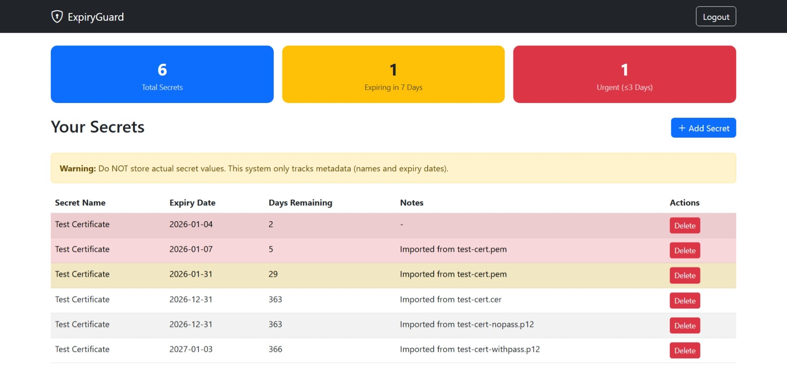
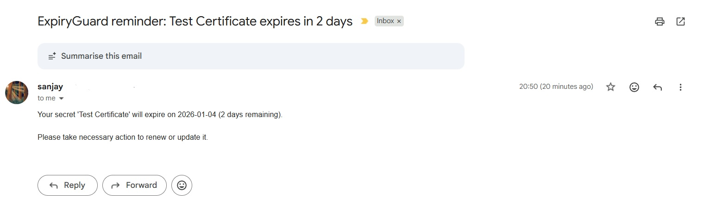

# 🔐 ExpiryGuard

**Never miss an expiring certificate or API key again.**

ExpiryGuard is a self-hosted secret expiration tracker that sends notifications before your certificates, API keys, and credentials expire.


---

## ❗ What ExpiryGuard Is (and Is Not)

ExpiryGuard is a **small, self-hosted utility** for tracking expiration dates of assets that automated scanners cannot see (offline certificates, API keys, vendor tokens).

It is intentionally **not**:
- a full secrets manager (Vault, 1Password, etc.)
- an automated certificate scanner
- a compliance platform
- a hosted SaaS

If you already have a mature CMDB, ticketing workflows, or enterprise secret management, this tool may not add value for you.

---

## 💡 Why This Exists

ExpiryGuard was built after repeatedly seeing certificate and API key expirations tracked in spreadsheets, calendars, or personal reminders — often owned by a single person.

The goal is not to replace mature tooling, but to provide a simple, explicit registry for "un-scannable" expiries with zero automation magic.

---

## 👥 Who This Is For

- Small teams without a full CMDB
- Individual engineers managing multiple environments
- Agencies managing client certificates
- Anyone currently using spreadsheets or calendar reminders

## 👥 Who This Is NOT For

- Organizations with strict compliance requirements
- Teams already fully automated via enterprise tools
- Environments requiring high availability guarantees

---

## ✨ Features

- 📅 **Track expiration dates** for certificates, API keys, tokens, and secrets
- 📧 **Email notifications** at 30, 7, and 3 days before expiry
- 📜 **Certificate parsing** - drag & drop .p12, .pem, .cer files to auto-extract expiry
- 🔒 **Multi-user support** with secure authentication
- 🐳 **Docker-ready** with PostgreSQL
- 💬 **Optional webhook notifications** (Slack/Discord) for team alerts

---

## 📸 Screenshots

### Dashboard
Simple overview of all tracked expiries with urgency highlighting.



### Add Secret (with Certificate Import)
Drag & drop a certificate to auto-extract expiry date.


### Email Notification
Example of an expiry reminder email.



---

## �🚀 Quick Start

### Prerequisites

- Docker & Docker Compose
- Gmail account with [App Password](https://support.google.com/accounts/answer/185833) (for email notifications)

### 1. Clone the repository

```bash
git clone https://github.com/sanjayselvaraj/expiryguard.git
cd expiryguard
```

### 2. Configure environment

```bash
cp .env.example .env
# Edit .env with your settings
```

### 3. Run with Docker Compose

```bash
docker-compose up -d
```

### 4. Access the app

Open http://localhost:8181 and register your first account.

---

## ⚙️ Configuration

### Environment Variables

| Variable | Description | Required |
|----------|-------------|----------|
| `MAIL_USERNAME` | Gmail address for sending notifications | Yes |
| `MAIL_PASSWORD` | Gmail App Password (not regular password) | Yes |
| `SLACK_WEBHOOK_URL` | Slack incoming webhook URL | No |
| `DISCORD_WEBHOOK_URL` | Discord webhook URL | No |
| `SCHEDULER_CRON` | Notification schedule (default: `0 0 9 * * *`) | No |
| `SCHEDULER_TIMEZONE` | Timezone for scheduler (default: `UTC`) | No |

### Notification Thresholds

ExpiryGuard sends notifications at three urgency levels:

| Days Remaining | Level | Description |
|----------------|-------|-------------|
| ≤ 3 days | 🚨 URGENT | Immediate action required |
| ≤ 7 days | ⚠️ WARNING | Plan remediation |
| ≤ 30 days | 📅 NOTICE | Awareness notification |

Each threshold fires **only once** per secret to avoid notification fatigue.

---

## 🔔 Optional: Webhook Notifications

If you want team-wide alerts in Slack or Discord, you can optionally configure webhooks.

### Slack

1. Create an [Incoming Webhook](https://api.slack.com/messaging/webhooks)
2. Add to `.env`: `SLACK_WEBHOOK_URL=https://hooks.slack.com/services/xxx`

### Discord

1. Server Settings → Integrations → Webhooks → New Webhook
2. Add to `.env`: `DISCORD_WEBHOOK_URL=https://discord.com/api/webhooks/xxx`

---

## 🛠️ Development

### Run locally with H2 database

```bash
# Set environment variables
export MAIL_USERNAME=your@gmail.com
export MAIL_PASSWORD=your-app-password

# Run with H2 profile
./mvnw spring-boot:run -Dspring-boot.run.profiles=h2
```

### Build JAR

```bash
./mvnw clean package -DskipTests
```

---

## 📁 Project Structure

```
src/main/java/com/expiryguard/
├── controller/     # REST controllers
├── entity/         # JPA entities (User, Secret)
├── repository/     # Spring Data repositories
├── scheduler/      # Notification scheduler
└── service/        # Business logic
```

---

## 🤝 Contributing

Contributions are welcome, but please note that this project is maintained on a best-effort basis.

1. Fork the repository
2. Create your feature branch (`git checkout -b feature/amazing-feature`)
3. Commit your changes (`git commit -m 'Add amazing feature'`)
4. Push to the branch (`git push origin feature/amazing-feature`)
5. Open a Pull Request

---

## 📄 License

This project is licensed under the MIT License - see the [LICENSE](LICENSE) file for details.

---

## 🙏 Acknowledgments

- Built with [Spring Boot](https://spring.io/projects/spring-boot)
- UI powered by [Bootstrap](https://getbootstrap.com/)
- Certificate parsing with [node-forge](https://github.com/digitalbazaar/forge)